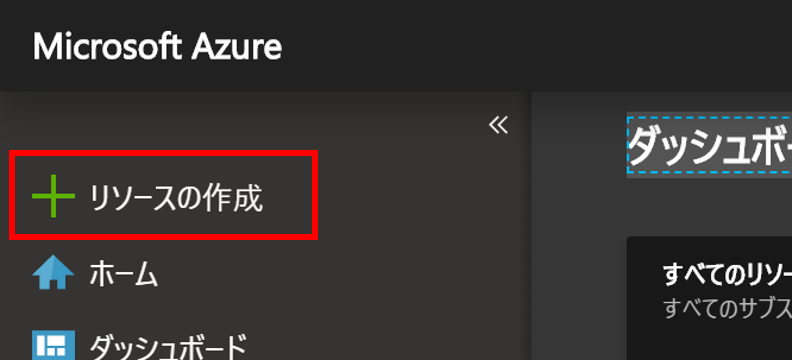
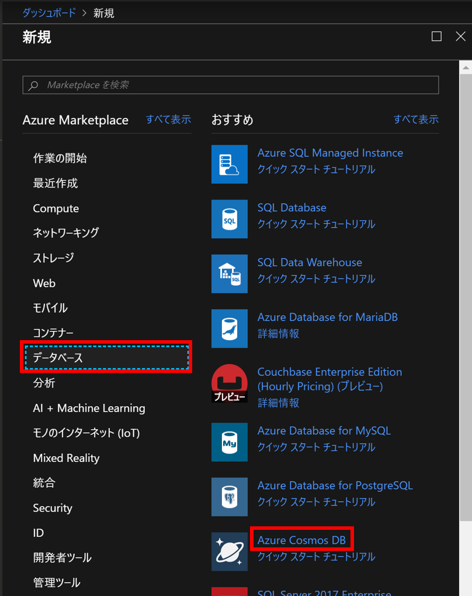
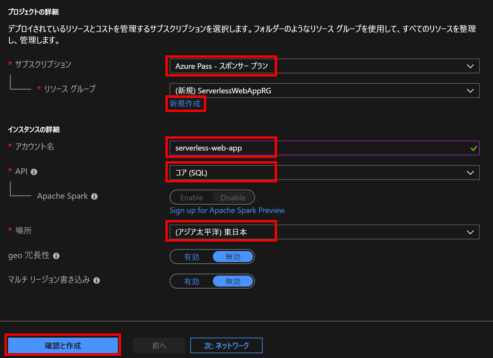
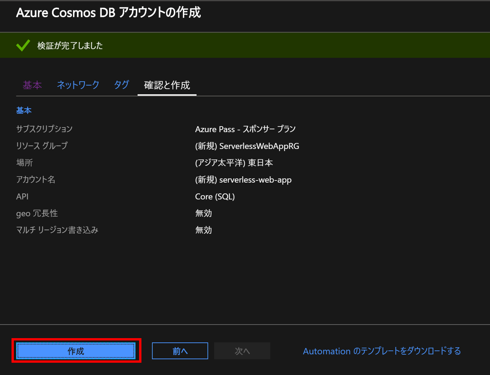
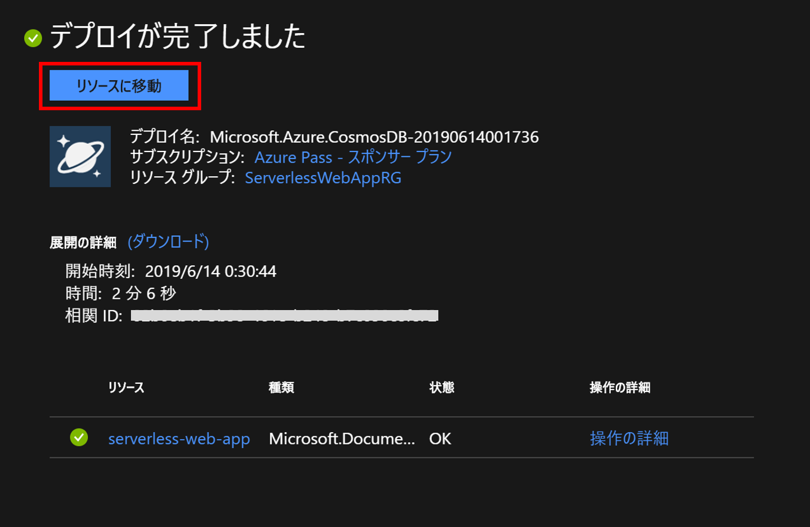
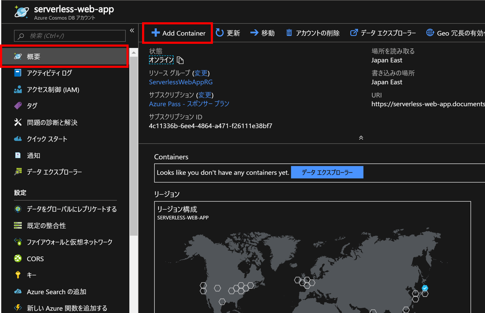
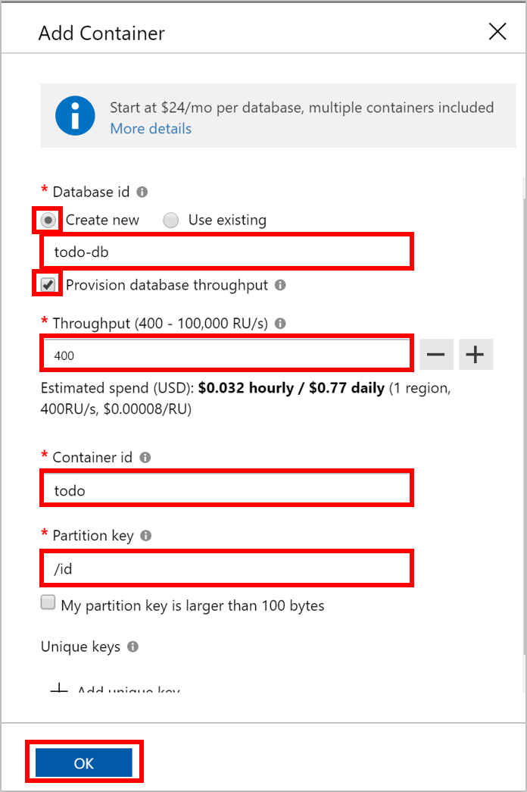
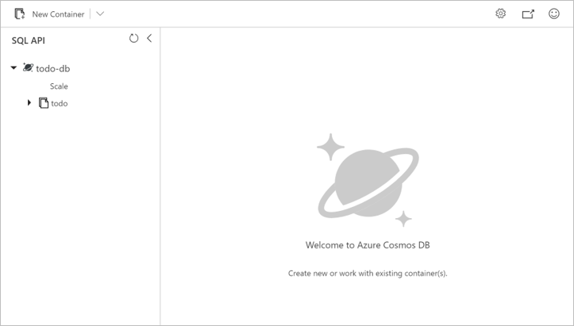

# STEP1 Azure Cosmos DBアカウント・コンテナー作成
まずはCosmos DBを用意します。

## ポータルからDBインスタンスを作成

[ポータル](https://portal.azure.com)の [リソースの作成] をクリックします。

[データベース] の中から [Azure Cosmos DB] を探し、クリックします。

Cosmos DBのアカウント作成画面に遷移するので、以下のように設定をします。

- サブスクリプション：今回使用するもの
- リソースグループ： [新規作成] から作成（例では`ServerlessWebAppRG`としました）
- API：`コア (SQL)`
- 場所：お好きなリージョン（例では`東日本`）

[geo 冗長性] と [マルチ リージョン書き込み] は`無効`のままでOKです。

今回使用するCosmos DBの`コア (SQL)` APIは、ドキュメント型データベースを慣れ親しんだSQL形式のクエリで操作ができるタイプのものです。

設定ができたら [確認と作成] をクリックし、入力内容の検証を待ちます。

検証が完了したら、[作成] をクリックします。

デプロイが開始するので、少しの間待ちます。

2分ほどで完了するので、完了したら [リソースに移動] をクリックし、作成したCosmos DBのアカウントに実際にデータを格納するための「コンテナー」を作成していきます。

## コンテナーの作成

Cosmos DBの画面が開いたら [概要] の [Add Container] をクリックします。

追加するコンテナーについて、以下のように設定します。

- Database id：[Create new] を選択し、`todo-db` と入力
- Provision database throughput：チェックを入れる
- Throughput：400
- Container id：`todo`
- Partition key：`/id`

Cosmos DBではもともと、コンテナー（リレーショナルDBにおけるテーブルに相当）単位でスループットの設定をする必要があり、この単位で課金される形態でしたが、`Provision database throughput`にチェックを入れることで、データベース単位でのスループット設定・課金に変更できるようになりました。
今回もデータベース単位にする設定をしています。

設定ができたら [OK] を押します。

※注意

今回パーティションキーには `id` を指定していますが、本来パーティションはデータを分類ごとに（論理的に）分けて検索しやすくするためのものなので、実際の運用上はTODOアプリならユーザーやカテゴリなどの情報をパーティションキーとして設定するとよいでしょう（今回そういった属性はないので簡略化しています）。

以下のような画面が出れば、コンテナー作成成功です。

これでSTEP1は終了です。
次は、[STEP2 Azure FunctionsでのAPI作成](../step2-functionapp/README.md)です。
今回作ったデータベースとAzure Functionsを接続し、データの読み書きを行うAPIを作成していきます。
