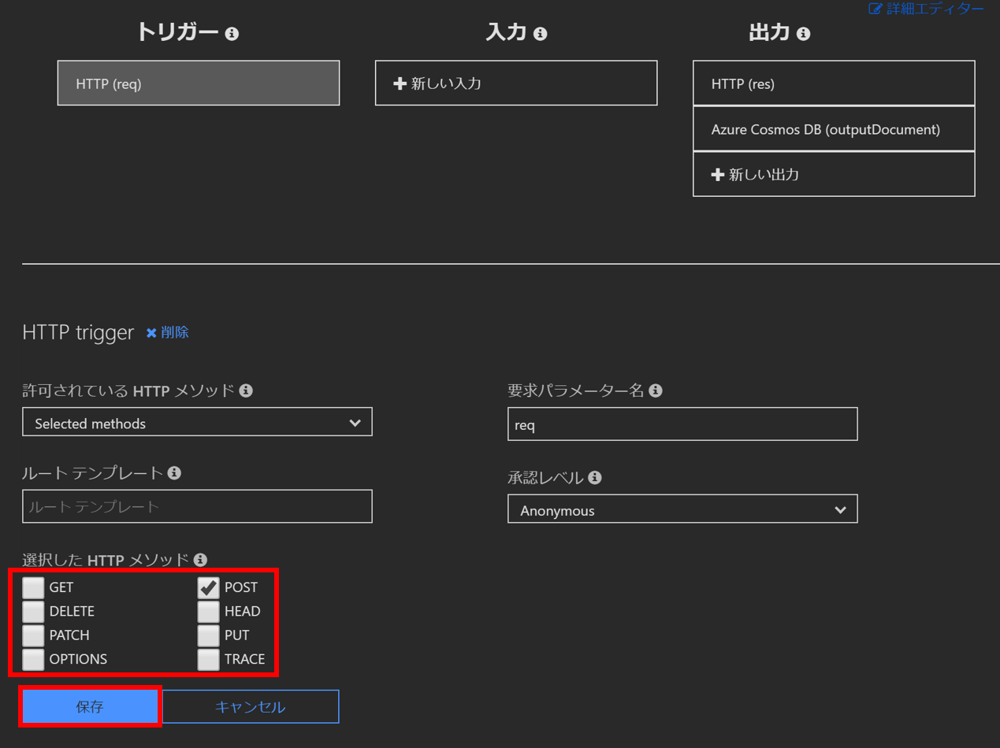

# STEP2 Azure FunctionsでのAPI作成
続いて、Azure FunctionsでFunction App（関数アプリ）を作成します。

今回はAzureポータルでコードを書いていきます。言語はJavaScriptです。

Create/Read/Update/Deleteの4つの関数を作っていきます。
コードは[src](../src)フォルダにあるコードをコピペして使用します。

## Function Appの作成
まずFunction App（関数アプリ）を作ります。

Function Appには、複数のFunction（関数）を作ることができ、今回はこの中に4つの関数を作ります。


ポータルから [リソースの作成] → [Compute] → [Function App] とクリックします。


以下のとおり、必要な情報を入力・選択します。
- アプリ名：お好きな名前
- サブスクリプション：Cosmos DBと同様
- リソースグループ：Cosmos DBと同様
- ホスティングプラン：従量課金プラン
- 場所：東日本
- ランタイムスタック：JavaScript

※その他はデフォルトのままでOK

すべて入力できたらOKをクリックします。


デプロイが開始するので、完了後、[リソースに移動] をクリックしFunction Appの画面へ遷移します。


## Create関数の作成
最初にCreate関数を作ります。

### HTTPトリガーで関数を作成
遷移してきたFunction Appの画面で [関数] をクリックし、[＋新しい関数] をクリック（または、[関数] 横の [＋]ボタンをクリック）して関数作成画面へ移動します。


今回作るのはREST APIなので、HTTPのリクエストをトリガーとして起動する関数を作成します。[HTTP trigger] をクリックします。


関数の名前として`Create`と入力します。

承認レベルは`Anonymous`にします（リクエスト時にキーの引き渡しが不要。今回は手順簡略化のためにこの設定を使用します）。


コードの入力欄が表示されるので、最初に書かれていたコードをすべて削除し、[Create.js](../src/function-app/Create.js) のコードを貼り付け、[保存] をクリックします。


### Cosmos DBバインドの設定
続いて、Cosmos DBとの接続を設定します。
この関数はCreate（新規作成）なので、DBへの書き込み処理を行う関数なので、出力バインドのみ設定します。


作成されたCreate関数の [統合] をクリックし、[出力] の [+新しい出力] をクリックします。

出力バインドの種類が選べるので、その中から [Azure Cosmos DB] を選択し、[選択] をクリックしてください。


続けてCosmos DBとのバインド設定に移ります。

拡張機能がインストールされていないというメッセージが出るので、[インストール] をクリックしCosmos DB用の拡張機能をインストールします（この操作が必要なのは最初の関数のみです）。


インストールの完了を待ちながら、データベース名に`todo-db`、コレクション名に`todo`と入れます。これはSTEP1で作ったCosmos DBのデータベース名とコンテナー名と一致している必要があります。


Cosmos DBアカウント接続は [新規] からサブスクリプションとアカウントを選択して設定します。

この設定も最初の関数のみで、あとから作る関数ではここで選択したアカウントがはじめから選択された状態になっています。


[Create.js](../src/function-app/Create.js)のソースコードを確認するとわかるように、出力バインドの設定をすると、Cosmos DBへのアクセスが非常に簡単になります。

```js
// リクエスト本文をそのまま格納
context.bindings.outputDocument = req.body;
```

拡張機能のインストールが完了し、すべて設定し終えたら [保存] をクリックします。


### HTTPメソッドの設定
トリガーについての設定で、HTTPメソッドを [POST] のみにします。



### 実行確認
これで関数は完成なので、実行確認をします。

関数名の「Create」をクリックし、右端（表示されていない場合はスクロールしてください）にある [テスト] をクリックします。


右端にテスト画面が表示されるので、HTTPメソッドを`POST`にし、要求本文に以下のJSON文字列を指定します。

```json
{
    "title": "test-title",
    "content": "test-content"
}
```


入力したら最下部にある [実行] ボタンを押します。


以下のように実行します。

正しく実行された場合、以下のように「200」のステータスコードが表示されます。


実際にデータベースにデータが入ったかどうか確認したいところですが、直接データベースは見ずに、次に作成するRead関数を実行することで確認することにします。

## Read関数の作成
関数の[+]ボタンから新しい関数を作成します。

`Read`, `Anonymous`とし、[作成] をクリックします。


### コードの登録
さきほどと同様に[Read.js](../src/function-app/Read.js) のコードを貼り付け、[保存] をクリックします。


### バインド、トリガーの設定
このRead関数はCosmos DBからデータを読み取るための関数なので、入力バインドを設定していきます。

作成されたRead関数の [統合] から [＋新しい入力] をクリックします。


Createの出力バインドを設定した時と同じように、データベース名に`todo-db`、コレクション名に`todo`を入力します。

アカウント名を確認し、[保存] をクリックしてください。


また、トリガーのHTTPメソッドも同様に設定します。ここで許可するのはGETメソッドです。


### 実行確認
設定ができたら、Read関数もテストしていきます。

さきほどのようにテスト画面を表示させ、メソッドを`GET`にして実行します。


さきほどCreate関数のテストで登録したデータが表示されれば成功です。


## Update関数
同じようにUpdate関数も作ります。


コードは[Update.js](../src/function-app/Update.js) を使用します。

### 関数の作成とバインド、トリガーの設定
Update関数は、データベースのデータを取り出し、加工して再度保存する処理になるので、入力バインドと出力バインドの両方の設定が必要です。

手順はこれまでとほぼ同一なので省略します。


### 実行確認
更新できるか確認します。

一度Read関数をテスト実行し、そこで表示されるidをコピーしておきます。

Update関数のテスト画面を開き、メソッドは`PUT`を選択し、「クエリ」の [name] に`id`、[value] にさきほどコピーしたid文字列を入力します。

要求本文には以下のJSONを入れ、実行します。

```json
{
    "title": "",
    "content": "",
    "isChecked": true
}
```


200のステータスコードが確認できたら、結果をRead関数のテストで確認します。

なお、ここで設定した`isChecked`はTODOが完了したことを表すチェック有無のプロパティです。

## Delete関数
最後にDelete関数です。

今回、削除処理は`isDeleted`プロパティを`true`にすることで行う論理削除処理となります。

そのため、やることはUpdate関数と同じです。

### ソースコードの登録
コードは[Delete.js](../src/function-app/Delete.js) を使用します。

### 設定など
入力と出力のバインドを設定し、DELETEメソッドのみを許可します。


### 実行確認
メソッドを`DELETE`にし、クエリにidを設定し、要求本文なしで実行します。

これにより論理削除が成功すると、Read関数の実行でデータが表示されなくなっているはずです。


## プロキシの設定
ここまでに作った関数は、REST形式になっていません。

それぞれのURL内にCreateやReadなど、操作に関する文字列を持っています。


そこでAzure Functionsのプロキシ機能を使い、これらのURLをひとつのエンドポイントにまとめ、4つの操作をメソッドで切り分けるように設定していきます。

[プロキシ] の [＋]ボタンからあたしいプロキシを作成します。


### Create
まずはCreate用です。
- 名前：`todo-create`
- ルートテンプレート：`todo`
- HTTPメソッド：`選択したメソッド`にし`POST`のみチェック
- バックエンドURL：`(関数のURL)/Create`

設定ができたら [作成] をクリックします。


バックエンドURLは、どの関数でもいいのであらかじめ関数URLをコピーしておき、それをもとに各プロキシに設定していきます。


### Read
続いてRead用です。Readはidを指定せず全件取得するためのものと、idを指定して特定のデータを取得するものの2種類のプロキシがいります（ただい今回のアプリで後者は未使用）。

一覧取得用は以下の通りです。
- 名前：`todo-read-list`
- ルートテンプレート：`todo`
- HTTPメソッド：`選択したメソッド`にし`GET`のみチェック
- バックエンドURL：`(関数のURL)/Read`


特定データの取得用は以下の通りです。
- 名前：`todo-read`
- ルートテンプレート：`todo/{id}`
- HTTPメソッド：`選択したメソッド`にし`GET`のみチェック
- バックエンドURL：`(関数のURL)/Read`
- [要求のオーバーライド]内のクエリ：`id`, `{id}`

ルートテンプレートが実際に使用されるURLですが、そこにパスとして入ってきたidがクエリに置き換えられて実行されるよう設定しています。


### Update
続けてUpdateのプロキシ設定です。
- 名前：`todo-update`
- ルートテンプレート：`todo/{id}`
- HTTPメソッド：`選択したメソッド`にし`PUT`のみチェック
- バックエンドURL：`(関数のURL)/Update`
- [要求のオーバーライド]内のクエリ：`id`, `{id}`


### Delete
最後にDeleteのプロキシ設定です。
- 名前：`todo-delete`
- ルートテンプレート：`todo/{id}`
- HTTPメソッド：`選択したメソッド`にし`DELETE`のみチェック
- バックエンドURL：`(関数のURL)/Delete`
- [要求のオーバーライド]内のクエリ：`id`, `{id}`


## CORSの設定
今回のAPIは、Blob Storageに配置した静的Webサイトのスクリプトから呼び出されます。

異なるドメイン間でのAPI呼び出しとなるため、CORS（Cross-Origin Resource Sharing）の設定が必要となります。


関数アプリの[プラットフォーム機能] から [CORS] をクリックします。


今回はすべてのドメインからCORSを許可したいので、初期設定にある [許可される元のドメイン] をいったんすべて削除します。


そして、すべて許可することを意味する `*` を入力します。


以上でSTEP2は終了です。
最後は、[STEP3 Azure Blob Storageでの静的Webサイトホスティング](../step3-blobstorage/README.md)です。