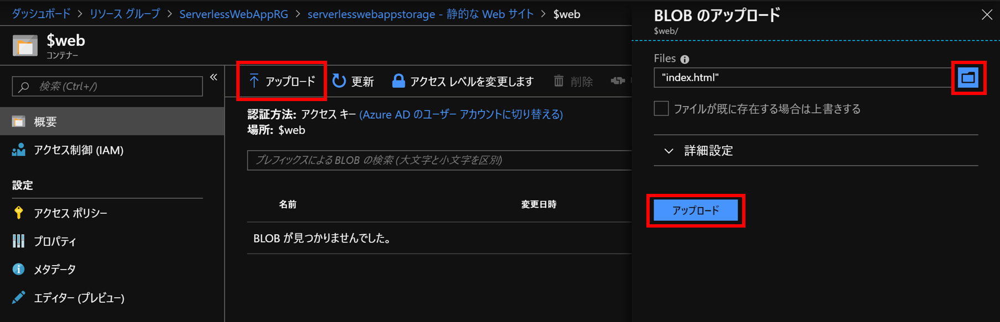

# STEP3 Azure Blob Storageでの静的Webサイトホスティング

最後に、Azure Blob Storageの静的Webサイトホスティング機能を使ってWebサイトの公開をします。
公開するのは、Vue.jsとVuetifyを使って作った簡易アプリケーションです。
TODOの作成などの機能を持ち、さきほどFunction Appとして作ったTODOのREST APIを呼び出します。

コードは本リポジトリの [static-web-vue](../src/static-web-vue) フォルダにあります。

## ストレージアカウントの作成

まずはストレージアカウントを作成していきます。


作成したら [静的な Web サイト]のメニューから静的なWebサイトを有効にし、インデックスドキュメント名を指定します。


ここでは `index.html` と入力し、[保存] をクリックします。
※今回はエラードキュメントのパスは空欄でOKです。

保存が完了すると、プライマリエンドポイントおよびセカンダリエンドポイントのURLが表示されます。
このURLがいま作っているWebアプリケーションのURLとなります。


静的Webサイトを配置するための [$web] という専用のコンテナーが作成されているので、これをクリックします。


## 静的Webサイトのアップロード

### index.html

$webコンテナーを開いたら、 [アップロード] をクリックして [index.html](https://raw.githubusercontent.com/himanago/azure-serverless-webapp-hands-on/master/hands-on/src/static-web-vue/index.html) をローカルに落としたものをアップロードしてください。
本リポジトリをcloneするか、[zipでダウンロード](https://github.com/himanago/azure-serverless-webapp-hands-on/archive/master.zip)してその中身(src/static-web-vue内)を使っても構いません。



### js/script.js

続いてJavaScriptファイルです。
ローカルにダウンロードした [script.js](https://raw.githubusercontent.com/himanago/azure-serverless-webapp-hands-on/master/hands-on/src/static-web-vue/js/script.js) の1行目、

```js
const apiUrl = '{YOUR API URL}';
```

を

```js
const apiUrl = 'https://todo-rest-api.azurewebsites.net/todo';
```

のように、STEP2でAzure Functionsのプロキシで定義したCRUD共通のURLを設定します。

修正が完了したら、ファイルを$webコンテナーにアップロードします。


こちらはアップロード時、フォルダー階層を分けるために [詳細設定] をクリックし [アップロード先のフォルダー] に `js` と入力してアップロードします。

なお、アップロード前にURLの修正を忘れてしまった場合は、アップロードされたJavaScriptファイルをポータル上でクリックし、[BLOBの編集] からAzureポータル上で直接編集が可能です。


ここまでですべての作業が完了です。

## 最終動作確認

さきほどのプライマリエンドポイントのURLをブラウザで開き、TODOアプリが動くか試してみましょう。


新規作成、チェックボックスのON/OFF、削除がすべて動けば成功です。

予期せぬ課金が発生しないよう、リソース類を削除するのを忘れないようにしましょう。

お疲れさまでした！
